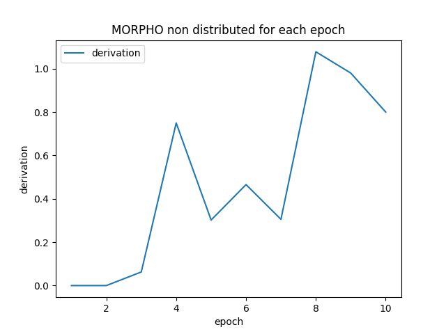
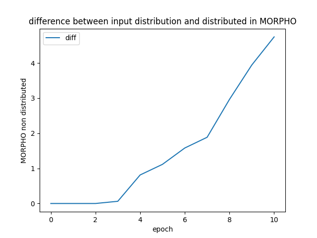

# **Morpho Rewards emission**

To understand the $MORPHO rewards mechanisms, you can take a look at the [documentation](https://docs.morpho.xyz/usdmorpho/ages-and-epochs).

## **Prerequisites**

Morpho Rewards can only be run on Node 18 and higher, notably due to its dependency to `fetch`, widely available since Node 18.

## **Get Started**

- make sure you are using the correct node version (>= 18)
```bash
nvm use
```

- Install node dependencies using `yarn`:


```bash
yarn install --frozen-lockfile
```

- Create an `.env` file and refer to the `.env.example` for the required environment variables.

All the scripts needs an `RPC_URL` and an `ETHERSCAN_API_KEY` to run.

- Run the tests that are computing distribution and verifying the root on chain:

```
yarn test
```

# Distribution

You can check [the documentation](https://docs.morpho.xyz/usdmorpho/ages-and-epochs) for a precise rule at each age:

## **Per-user, per-market distribution rule**

For a given market & a given side (supply/borrow), we distribute the rewards proportionally at the user balance.
For example, if Alice balance is representing 10% of the Morpho balance, she is accruing 10% of the MORPHO tokens while she is representing 10%.
The speed of MORPHO distribution is static in first instance for a given set of epoch, market, side (supply/borrow), and computed from a rule voted
by the governance for each epoch.

The subgraph used for automatic real-time indexation is available on the [hosted service of TheGraph](https://thegraph.com/hosted-service/subgraph/morpho-labs/morphoages?query=Get%20balances%20).

## **Per-market distribution process**

For each epoch, we distribute a given amount of rewards (e.g. 350,000 MORPHO for Age 1 - Epoch 1) overall open markets, ponderated by the underlying market-specific USD TVL, computed at the `snapshotBlock` of the epoch. This means that market ETH with `marketSupply` ETH supplied on the underlying pool, `marketBorrow` ETH borrowed from the underlying pool and a ETH at a price of `marketUSDPrice` at the first block of the epoch (according to Compound's protocol) will get the following amount of rewards distributed:totalEmission×(marketSupply+marketBorrow)×marketUSDPricetotalUSDTVL

You can compute the markets emissions using the following command:

```bash
yarn markets:emissions
```

this will output the per-market emissions in the [distribution](./distribution) directory.

If you want to compute the emissions for a specific epoch, you can use the `--id` flag:

```bash
yarn markets:emissions --id age2-epoch1
```

## **Subgraph**

The subgraph is tracking users position in "real time", but it must use the markets emissions as input.  
So after each market emission update, the subgraph must be bupdated by using IPFS file for the distribution.  
So you first need to generate the subgraph distribution file:

```bash
yarn markets:emissions:subgraph
```
Then, upload the generated file to IPFS and update the distribution IPFS hash on the subgraph [here](./subgraph/src/ipfs.ts).  
You need to reindex the subgraph from scratch in order to fully rsync the subgraph.

## **Epochs**

Morpho rewards are distributed through epochs (~3 weeks), with each epoch's per-market distribution ultimately being voted by the Morpho protocol's governance at the beginning of the Epoch. For now and until governance is set up, each epoch's per-market distribution is computed based on a given total emission distributed over open markets, based on their underlying TVL.

> **Note**: 
> After the end of the age 3, the future ages are no longer splitted in epochs, but in one period of 45 days long.
> The distribution will be computed at the end of the age, and the rewards will be claimable once the age is over.

## **Claim Rewards**

You can directly claim your rewards by using the Morpho dapp here: [governance.morpho.xyz](https://governance.morpho.xyz/)
or by calling the `claim` function of the [Rewards Distributor](https://etherscan.io/address/0x3B14E5C73e0A56D607A8688098326fD4b4292135)
with parameters coming from the last distribution in [proofs](./distribution/proofs) folder

You can also use the built-in script to claim your rewards:

```bash
yarn claim --private-key <your-private-key>
```

Note that a rpc node is required to claim your rewards. You can provide it using `RPC_URL` environment variable or the `--rpc-url` flag.


If you want to claim for someone else, you can also use a list of addresses:

```bash
yarn claim --private-key <your-private-key> --on-behalf <address1>,<address2>,<address3>
```

The script is batching the claim in one multicall transaction to save gas.

The script is not supporting hardware wallet signature for now.

If you just want to access the transaction data, you can call the `getUserRewards` script:

```bash
yarn getUserRewards <address>
```
If no calldata is returned, that means that you already have claimed your rewards.


## **Compute Merkle Tree**

At the end of each epoch, all tokens will be distributed.

You can compute the users distribution and the merkle tree using the following command:

```bash
yarn users:distribute
```

this will output the users distribution in the [distribution](./distribution) directory, and the merkle tree in the [proofs](./distribution/proofs) directory.

If you want to compute the users distribution for a specific epoch, you can use the `--epoch` flag:

```bash
yarn users:distribute --id age3-epoch2
```

You can also choose the data provider for the users balances between `rpc` or `subgraph`.

By default, the subgraph is used, but you can also use the on-chain data by using the `--dataProvider` flag.

NB: The on-chain data provider is not yet implemented.

```bash
yarn users:distribute --dataProvider subgraph
```

#### Age 1 Epoch 2 specifications

After the Age 1 Epoch 2, the script was refactored to improve distribution precision. The previous script and the current one are given the same result for the first epoch,
but the second epoch is different and more precise now. However, the on_chain root was computed at [this commit](https://github.com/morpho-labs/morpho-rewards/tree/49282489fc8e376a7806dc49ec145ed724b783ae)
and the result is [here](./distribution/fromDeprecatedScript/proofs-2.json).

### Terminate an epoch and updating the Merkle tree root on chain

After each epoch, Morpho Labs is computing the Rewards distribution and submitting the new root to the Morpho governance.
The process can take some time after the end of the epoch, that can lead users to not be able to claim rewards from the last epoch for a short time.
In the Morpho Labs dapp, you will be able to see your rewards with a field "Claimable soon" in the Claim Modal, which is representing the amount claimable after the
update of the root on chain (rewards of the previous epoch). You are still able to claim the rewards of the older epochs (n - 2) and still accruing rewards for the current epoch n

## Rounding errors

Due to rounding errors, the total amount distributed has a precision of more or less 10e-9 MORPHO distributed (over all markets) for age 1, and 10e-2 for the age 2 etc. The following graph is showing the precision of the distribution for each epoch:

<div align="center">

</div>

The following graph shows the total amount of MORPHO not distributed due to rounding errors:

<div align="center">

</div>

# Vault distribution

The ERC4626 is a standard for vaults, which [is used on top of the Morpho protocol](https://github.com/morpho-labs/morpho-tokenized-vaults) to aggregate users.
Each Vault Contract has MORPHO rewards distributed from main distribution, and must redistribute rewards to users who are depositing their tokens in the vaults.

`morpho-rewards` is providing a standardized script to redistribute MORPHO rewards to vaults users through a dedicated merkle tree.

To use it, you can change the configuration here: [src/vaults/script/configuration.ts](.src/vaults/script/configuration.ts) with your own Vaults parameters.

Then, you can run the script to compute the distribution and the Merkle tree:

```bash
yarn vaults:distribute
```

The output will be in the `distribution/vaults` folder.
By default, the script provides only the last epoch merkle tree, but if
you want to have per-epoch distribution, you can run the script with the flag `--save-history` to save the distribution of each epoch:

```bash
yarn vaults:distribute --save-history
```

You can also merge all your vaults distributions to only one Merkle tree by using the flag `--merge-trees`:
It is useful when you have multiple vaults, and you want to merge all the distributions to only one Merkle tree.

```bash
yarn vaults:distribute --merge-trees --save-history
```

You can also specify an epoch to compute the distribution for a specific epoch:

```bash
yarn vaults:distribute  --merge-trees --save-history --epoch age5
```

It will compute the last epoch by default.

